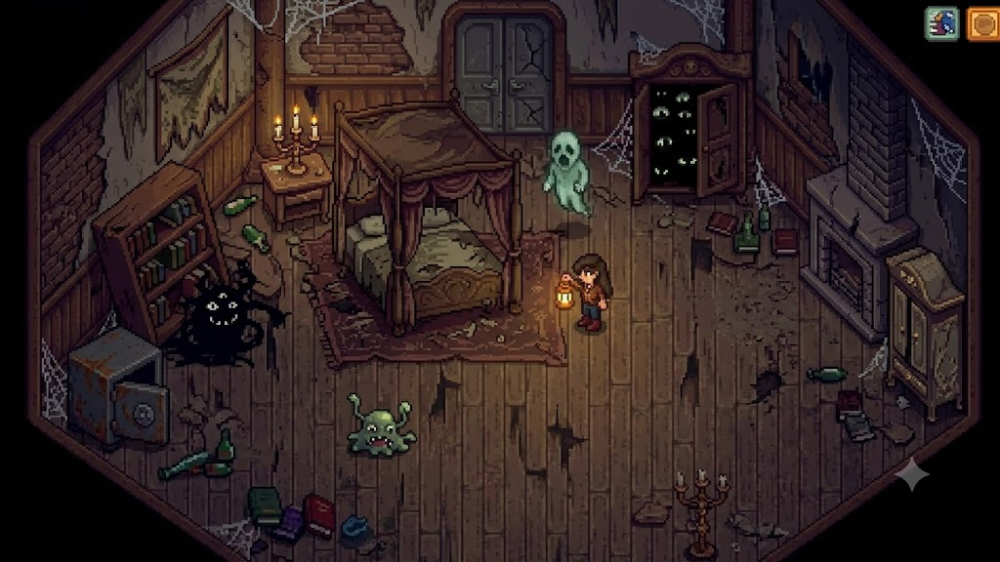

# Proyecto: Silent Cat

## 1. Integrantes del Equipo 

- Godoy, Aldana 
- Lacho, Melisa  
- Pardo, Iskari 
- Ugarte, Micaela

## 2. Dominio y Alcance del Sistema 

### Descripcion del problema 

Se buscara desarollar un videojuego de escritorio basandose en conceptos relacionados con el juego "Silent Hill". La tematica se basara en la eleccion de uno de los dos personajes que ofrecemos,junto con un tercer personaje, el cual sera su mascota - un gato -. Se buscara desarrollar un juego de estrategia y habilidades mediante la resolucion de acertijos para cumplir con el objetivo. 

## Objetivo del Sistema 

El sistema sera un juego que permitira al usuario la eleccion de uno de los dos personajes, teniendo como objetivo la busqueda del tercer personaje (su amigo gatuno) recorriendo un mapa - mansion terrorifica -. La finalidad es pasar 3 habitaciones a lo largo del juego, en donde el requisito para acceder al proximo nivel (un nivel por habitacion) es la resolucion de acertijos dinamicos. El usuario gana el juego cuando encuentra a su gato antes de perder sus 3 vidas. 

### Funcionalidades Principales (Features)

-**Personaje**

    -El personaje carga con una linterna con bateria limitada. 
    -El personaje tiene un artefacto para defensa personal en caso de ataque.
    -Se contara con una vida limitada, en donde el personaje tendra 3 intentos para lograr el objetivo.  
    -Se desarollara un "checkpoint" por habitacion / por nivel. (el progreso del jugador se guarda en caso de que su vida termine)

-**Enemigos** 

    -Caracteristicas del enemigo prontas a desarrollar. Por el momento hemos definidio: 
        -Objetivo: impedir que el personaje continue con su objetivo.
        -Personajes de aspecto feo y tenebrosos.
        -Dañaran la vida del personaje, decrementando los intentos que tiene para lograr el objetivo. 
        -Tiene vida limitada. 

-**Interfaz grafica (IGU)** 

    -Pantalla principal --> jugar, reiniciar desde checkpoint, salir. 
    -Pantalla de juego --> escenario de juego, personaje, puntos de vida, boton de salir. 

-**Persistencia** 

    -Estado de partida --> para guardar la partida y poder continuar en otro momento.  

## 3. Imagenes representativas de la idea planteada. 

## 4. Diagrama de Clases UML (Conceptual)

Enlace a CANVA: https://canva.link/c4rd5agxm72r0ff

     

